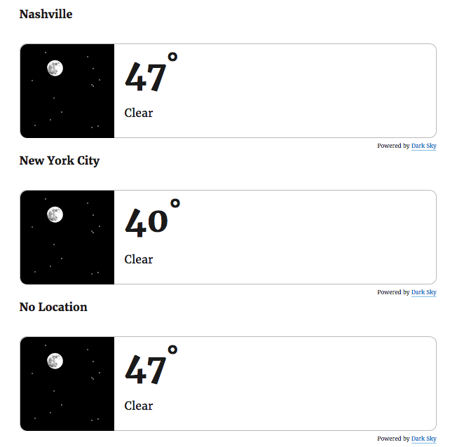
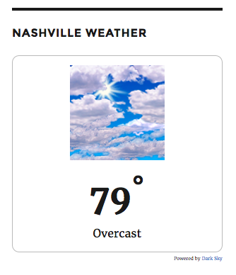
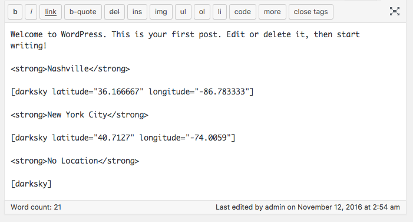
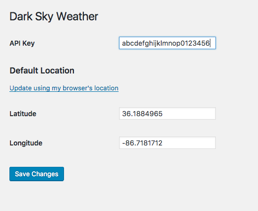

# Dark Sky Weather for WordPress

Show the current weather in your WordPress sidebar or inline with your posts and pages.

## Obtaining a Dark Sky API key

[Create a Dark Sky API Key](https://darksky.net/dev/register)

### A note on API limits and caching

The Dark Sky API provides up to 1,000 free requests per day for a registered developer. Greater than 1,000 calls are charged at a rate of $0.0001 per call. This plugin makes use of the [WordPress Object Cache](https://codex.wordpress.org/Class_Reference/WP_Object_Cache) to reduce the number of calls against the API to one per hour (per location) when combined with one of the several [persistent cache](https://codex.wordpress.org/Class_Reference/WP_Object_Cache#Persistent_Caching) plugins available.

## Installing the Plugin

1. Download the [zip file] or clone this repository into your `wp-content/plugins/` folder.
2. Navigate the "Plugins" section in the WordPress admin
3. Click "Activate" next to the plugin name
4. A message will appear saying the plugin needs an API key
5. Click the "Settings" link (either in the alert or in the side navigation) to provide an API key

## Using the Plugin

This plugin offers two approaches for use:

### Sidebar Widget

Add the "Weather" widget to your sidebar for themes that support them. If you are working with a custom theme, see the [documentation on adding a Widget sidebar](https://codex.wordpress.org/Widgetizing_Themes).

When added, you will be prompted to provide a latitude and longitude for your location. If you need to find the values for this, use can use [an online tool](http://www.latlong.net/).

### Shortcode

The `[darksky]` short code allows you to place the current weather conditions for a location in to a page or post.

An example for Nashville, Tennessee:

```
[darksky latitude="36.166667" longitude="-86.783333"]
```

A default option, which will use either Nashville, or the defaults specified in the Settings > Dark Sky Weather options page.

```
[darksky]
```

## Screenshots









## Development

### Compile the SCSS

1. [Install SASS](http://sass-lang.com/install)
2. Run `make compile_css` from the root of the plugin to compile changes.
3. Run `make watch_css` to watch for changes and auto-compile.

## Credits

- API powered by <a href="https://darksky.net/">Dark Sky</a>
- Icons created by the <a href="http://www.weather.gov/">National Weather Service</a>
